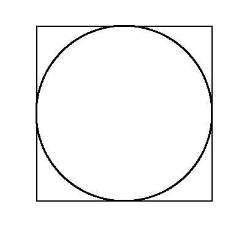

# Simulation for calculating the value of $\pi$

In this simulation we are going to estimate the value of $\pi$.

For this, consider a circle of radius $R$ inside a square of length $L = 2R$, as in the image below.

Now imagine we start randomly filling this square with points. Some of these points will fall inside the circle (let's call this number $n_{circle}$), some of them not. At some point, as the number of points increases, the area of the circle will be proportional to the number of points inside it, i.e., 
$$n_{circle} \propto A_{circle} = \pi R^2 ,$$
so
$$n_{circle} = aA_{circle} = a\pi R^2 ,$$
where $a$ is a proportionality constant.

The same will be true for the square, in which its area will be proportional to the total number of points, $n_{total}$, that is,
$$n_{total} \propto A_{square} = L^2 = 4R^2 ,$$
so
$$n_{total} = bA_{square} = bL^2 = 4bR^2 ,$$
where $b$ is a proportionality constant.

Assuming the points are uniformly distributed (which will be true as $n_{total} \to \infty$), then the density of points will be the same everywhere, and the proportionality constants $a$ and $b$ will be the same. (This will be verified in the code.) Therefore, we have
$$\frac{n_{circle}}{n_{total}} = \frac{a\pi R^2}{4aR^2} = \frac{\pi}{4}$$

$$\therefore \pi = \frac{4n_{circle}}{n_{total}} ,$$
which is what we are going to calculate here.
